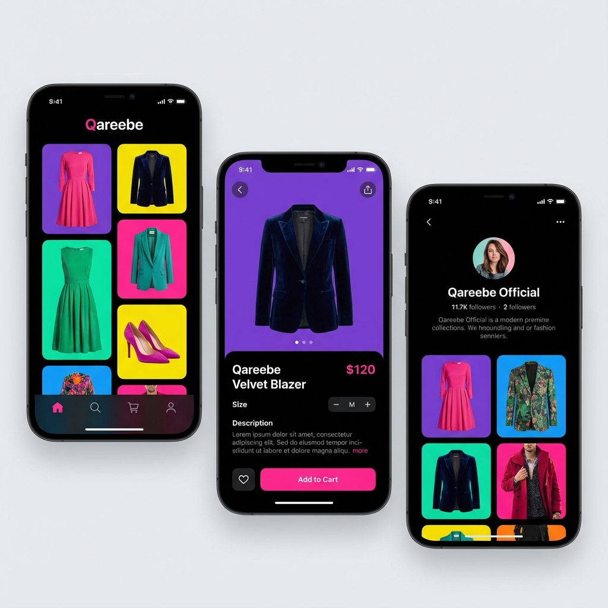

# Qareebe - Hyperlocal Fashion Ecosystem


A comprehensive, full-stack hyperlocal fashion ecosystem designed for the modern Pakistani market. Qareebe connects local boutiques and shops directly with customers through a suite of integrated mobile and web applications.

## 🚀 The Ecosystem

The Qareebe project consists of four main components interacting in real-time:

### 📱 [Customer App](qareebe-native/)
The flagship mobile experience for shoppers.
- **Browse & Search**: Explore local shops and trending fashion.
- **Hyperlocal Focus**: See shops nearest to your current location.
- **Seamless Checkout**: Easy cart management and order tracking.
- **Tech**: React Native, Expo, Firebase.

### 🏪 [Merchant App](shop-owner-app/)
A powerful mobile toolkit for shop owners.
- **Inventory Control**: Add, edit, and track stock with AI-assisted product scanning.
- **Sales Analytics**: Real-time sales tracking and order management.
- **Shop Profile**: Update business location and working hours easily.
- **Tech**: React Native, Expo, Firestore.

### 💻 [Developer Dashboard](developer-dashboard/)
The centralized hub for platform administration.
- **User Management**: Monitor and manage customer and merchant accounts.
- **System Metrics**: Track growth, sales, and platform health.
- **Shop Verification**: Overview of registered businesses.
- **Tech**: React, Vite, Tailwind CSS.

### ⚙️ [Backend API & Operations](server/)
The robust engine powering the entire platform.
- **Real-time Sync**: Firestore-backed data flow for instant updates across all apps.
- **Authentication**: Secure JWT and Firebase Authentication.
- **Scalable Architecture**: Express.js server handling core business logic.
- **Tech**: Node.js, Express, MongoDB/Firestore.

---

## 📸 Sneak Peek



---

## 🛠️ Quick Start

This monorepo contains multiple projects. To get started, follow the setup guide for each component.

### Prerequisites
- **Node.js**: v18.0 or higher
- **Firebase Account**: For Auth, Firestore, and Storage
- **Expo CLI**: `npm install -g expo-cli`

### Installation

1. **Clone the repository**:
   ```bash
   git clone https://github.com/Hamna-Zahid/Qareebe-react.git
   cd Qareebe-react
   ```

2. **Setup the Backend**:
   ```bash
   cd server
   npm install
   # Configure .env based on .env.example
   npm run dev
   ```

3. **Setup the Apps**:
   Choose the app you want to run (e.g., Merchant App):
   ```bash
   cd shop-owner-app
   npm install
   npx expo start
   ```

## 📜 Documentation Links

- [Setup Guide (Quickstart)](QUICKSTART.md)
- [MongoDB Setup](MONGODB_SETUP.md)
- [GitHub Workflow Guide](GITHUB_DESKTOP_GUIDE.md)

## 🤝 Contributing

We welcome contributions! Please see our [Contributing Guidelines](CONTRIBUTING.md) for more details.

## ⚖️ License

Distributed under the MIT License. See `LICENSE` for more information.

---
*Built with ❤️ for the Pakistani Fashion Community.*
